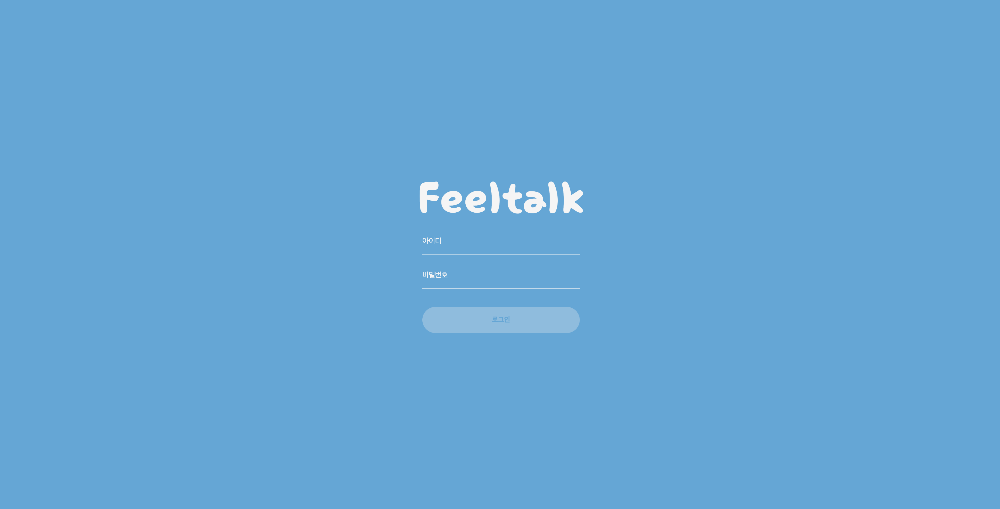

## login page

매우 간단한 로그인 화면입니다. 막 프론트엔드를 배우기 시작했을때 첫 프로젝트로 접해보면 좋을 것 같습니다.
HTML, CSS, JavaScript를 사용하여 기능을 구현했습니다.

## 기능 구현

- 아이디와 비밀번호를 모두 입력하면 로그인 버튼이 활성화
- 입력 형식이 올바르지 않으면 오류 메시지가 나타남
- 형식에 맞게 올바르게 입력한 경우, 정상적으로 알림 메시지가 표시됨

## 사용 기술
- **HTML**: 기본 구조 작성  
- **CSS**: 기본 스타일링 및 레이아웃  
- **JavaScript**: 동작 구현 및 이벤트 처리

## 화면 예시

